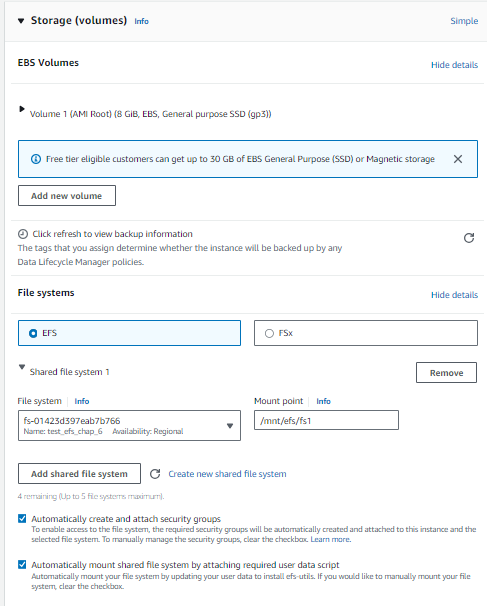

# EFS

## Attach EFS in EC2 creation step
- Step 1: Configure Networking (Subnets) 
- Step 2: Configure mount efs 

## Manually
Architect

Steps (!TODO)
- Create EFS
- Create Mount Point for each subnet (network interface ?)
- Create Security Groups (Allow inbound NFS 2049, Allow outbound NFS 2049)
- Attach Security Group
- Mount EFS to EC2: https://docs.aws.amazon.com/efs/latest/ug/mounting-fs-mount-helper-ec2-linux.html