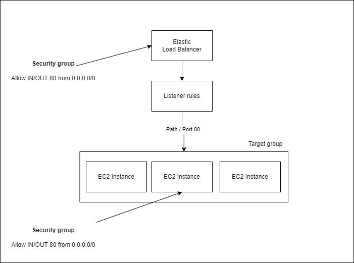

# Instruction for setting up Target Group & ELB

## Architect

Components:
- Elastic Load Balancer
  - ELB Instance (Application)
  - ELB Listener
- EC2 
  - Target Group
  - Instances

## Details
### ELB
ELB Instance
#### ELB Instance attached with a Security Groups allowing 
  - Ingress: port 80, from 0.0.0.0/0
  - Egress: port 80, from 0.0.0.0/0

#### ELB Listener
  - attach to ELB instance
  - point to Target group (path /, port 80)

### EC2
#### Instances
- Attached with with a Security Groups allowing 
  - Ingress: port 80, from 0.0.0.0/0
  - Egress: port 80, from 0.0.0.0/0
- Attached with a Security Group allowing SSH from current IP

#### Target Group
Target group
- Same VPC and Subnet
- Port 80 / protocol HTTP
- Health check
- Attach EC2 Instances to Target group